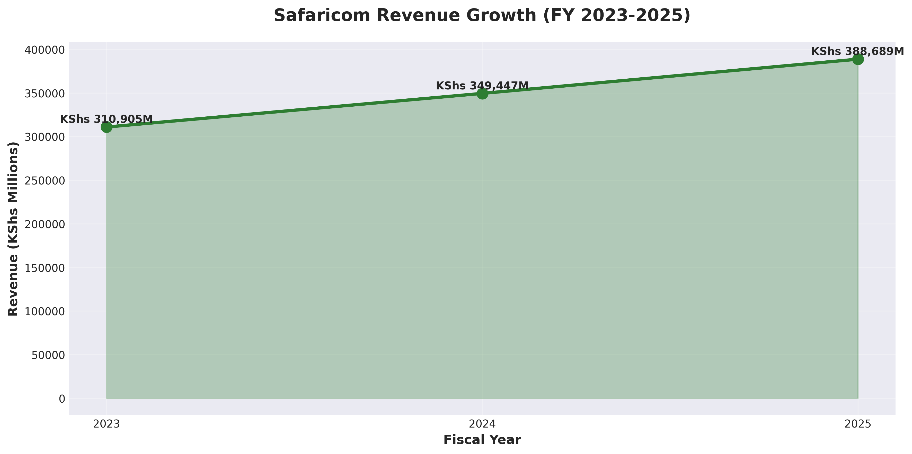
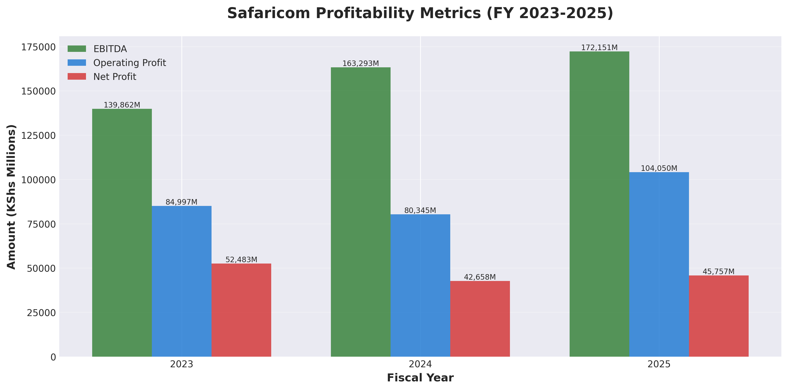
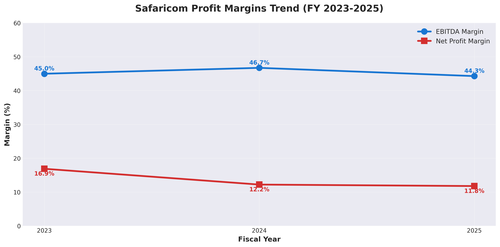
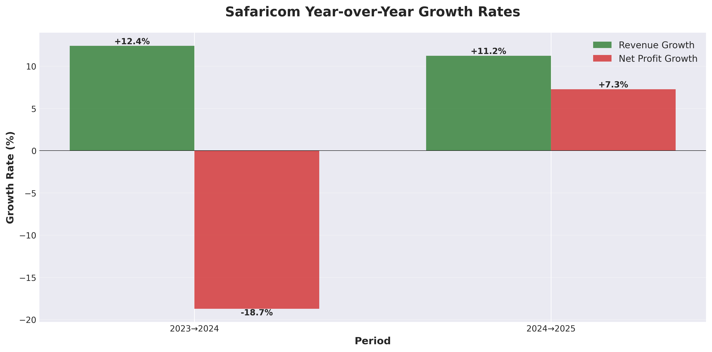
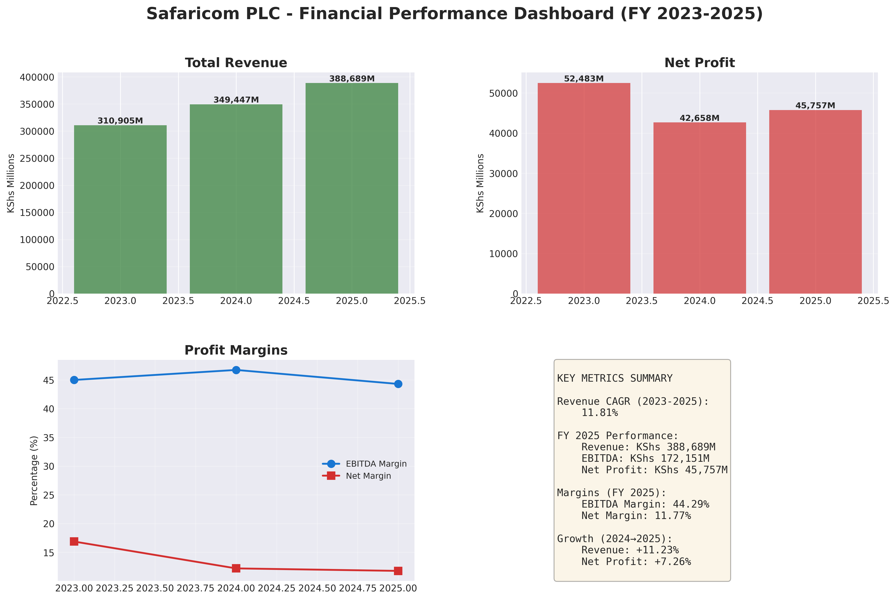

# Safaricom Financial Analysis Pipeline

A data engineering project that extracts, transforms, and loads financial statement data from Safaricom PLC annual reports for analytical purposes.

## Project Overview

This project demonstrates end-to-end data engineering skills by building an ETL pipeline for financial data analysis of Safaricom, Kenya's largest telecommunications company.

## Technologies Used

- **Python 3.12**: Core programming language
- **pdfplumber**: PDF data extraction
- **pandas**: Data manipulation and transformation
- **PostgreSQL**: Relational database for structured storage
- **SQLAlchemy**: Database ORM and connection management

## Project Structure
## Visualizations

The project includes 5 comprehensive visualizations:

### 1. Revenue Trend

### 2. Profitability Metrics

### 3. Profit Margins

### 4. Year-over-Year Growth

### 5. Financial Dashboard

